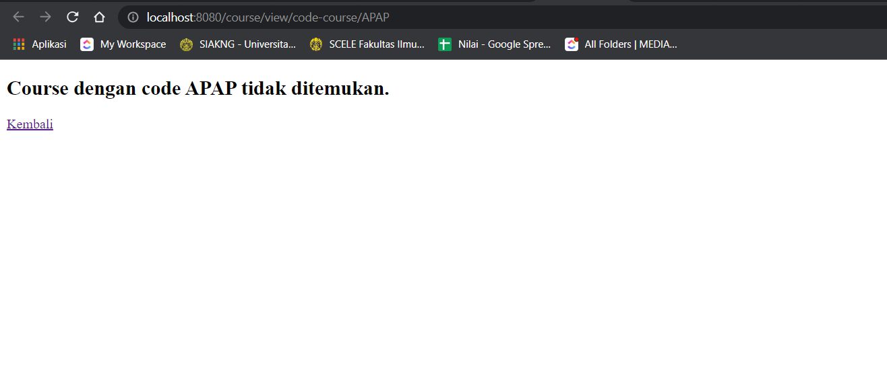

# Tutorial APAP

## Authors

* **Zundullah B. Djibat** - *2006464505* - *APAP SP*

---
## Tutorial 4
### What I have learned today
Pada tutorial kali ini, saya mempelajari tentang common command pada React beserta kegunaanya. Selain itu, saya juga mempelajari mengenai kompatibilitas dari dependensi React yang saya gunakan.

### PERTANYAAN:
#### 1. Jelaskan maksud compatibility dan deprecated terkait dependency!
Compatibility adalah kemampuan dua atau lebih komponen untuk bekerja sama secara efektif. Dalam konteks dependency, compatibility mengacu pada kemampuan dua atau lebih library untuk bekerja sama secara efektif sehingga aplikasi bisa berjalan dengan lancar
Deprecated adalah istilah yang digunakan untuk menggambarkan sesuatu yang tidak lagi didukung. Dalam konteks dependency, deprecated mengacu pada library yang tidak lagi didukung oleh pengembangnya. Jika suatu aplikasi menggunakan dependency yang bersifat deprecated, maka vulnerabilitas aplikasi tersebut menurun dan mudah untuk terkena ancaman security dan bug.
#### 2. Mengapa memilih versi yang stabil lebih diprioritaskan dibandingkan memilih versi yang terbaru tetapi belum stabil?
Dalam memilih dependency, disarankan selalu menggunakan versi stabil dibandingkan versi terbaru yang belum stabil karena versi yang stabil sendiri sudah dipastikan aman dari sisi security serta compatibility. Artinya
aplikasi yang mengggunakan dependency yang stable tidak beresiko untuk mengalami masalah atau gangguan.
Dependency yang terbaru dan kurang stabil tidak disarankan karena dari sisi compatibility bisa saja ada library yang belum support dependency versi terbaru, selain itu 
dari sisi security lumayan beresiko karena versi yang belum stabil.
#### Selain menggunakan npm, dapat digunakan juga command yarn. Tuliskan command yarn yang setara dengan command-command npm diatas (apabila ada)
Command npm dengan pasangan command yarn:
- npm install dan yarn add
- npm uninstall dan yarn remove
- npm update dan yarn upgrade
- npm audit dan yarn audit
- npm start dan yarn start
### What I did not understand
- []

---
## Tutorial 3
### What I have learned today
Pada tutorial kali ini saya sudah mempelajari bagaimana cara menginstall dan menggunakan React.js untuk membuat suatu aplikasi ecommerce sederhana.
Saya juga mempelajari mengenai apa itu STATEFUL dan STATELESS dalam suatu component yang dibuat dalam React.

### PERTANYAAN
#### 1. Menurut pemahaman kamu selama pengerjaan tutorial ini, apa perbedaan antara state dan props?
State adalah jenis data yang disimpan dalam suatu component. Pada tutorial kali ini, state adalah daftar dari produk yang tersedia baik di daftar produk utama maupun daftar produk yang berada di keranjang.
Props sendiri adalah jenis data yang dikirimkan dari suatu component ke component lainnya, misalnya component induk. Dalam tutorial kali ini, props merupakan data jumlah produk yang dimasukkan kedalam keranjang dan ditandai jumlahnya pada tombol keranjang yang sudah dibuat
#### 2. Menurut kamu, apakah sebaiknya kita menggunakan component (e.g. List, Item) dalam React? sebutkan alasannya.
Menurut saya, penggunaan component-component tesebut harus sesuai dengan tujuan atau fitur apa yang ingin kita kembangkan dalam react. Fitur List sendiri akan membuat suatu list dari data serta Item befungsi untuk menampilkan detail data apa saja yang kita miliki.
Selain itu, keuntungannya adalah komponen membuat kode lebih mudah dipahami dan dikelola.
#### 3. Apa perbedaan class component dan functional component?
Class component adalah komponen dalam React yang menggunakan class serta merupakan inheritance dari React.component. Class component sendiri menggunakan render() untuk memunculkan tampilan.
Functional component adalah komponen dalam React yang dibentuk seperti fungsi javascript biasa. Functional component sendiri merupakan jenis komponen yang bersifat "baru"
karena pengembangan aplikasi React sekarang lebih sering menggunakan Functional component dibanding Class component. Untuk syntaks, Class component lebih kompleks dibandingkan Functional Component.
Hal tersebut karena  Class component memerlukan this. untuk declare variabel yang digunakan. Functional component tidak memerlukan this.
#### 4. Dalam react, apakah perbedaan component dan element?
Component adalah blok bangunan dasar dari aplikasi React. Component dapat digunakan untuk membuat tampilan yang kompleks dan dapat digunakan kembali. Elemen adalah representasi dari Component di DOM. Elemen dibuat oleh component dan dirender oleh React DOM.
Berikut adalah beberapa perbedaan utama antara komponen dan elemen:
- Component adalah fungsi, sedangkan elemen adalah objek.
- Component dapat memiliki state dan props, sedangkan elemen tidak dapat memiliki state atau props.
- Component dapat menangani peristiwa, sedangkan elemen tidak dapat menangani peristiwa.
- Component dapat digunakan untuk membuat tampilan yang kompleks, sedangkan elemen hanya dapat digunakan untuk membuat tampilan yang sederhana.
- Component dapat digunakan kembali, sedangkan elemen tidak dapat digunakan kembali.
### What I did not understand
- [] Kenapa harus belajar React.js

---
## Tutorial 2
### What I have learned today
Pada tutorial kali ini, saya sudah mempelajari mengenai konsep MVC (Model, View, Contoller) dan implementasinya pada Springboot. Saya mempelajari bagaimana membuat fitur fitur
dari soal Lab yang diberikan menggunakan gabungan fungsionalitas dari Controller, Model, Service dan View. Lab kali ini lumayan panjang dan seru serta saya juga belajar mandiri
bagaimana mengerjakan fitur-fitur pada Latihan di Soal Lab serta membuat koneksi dari Aplikasi Belajarbelajar ke dalam database. Saya juga memperdalam bagaimana menggunakan XAMPP dan MySQL,
membuat repository untuk database serta bagaimana mengkoneksikannya ke Model dan menampilkan Data-data dari database menggunakan View yang di render oleh Controller.

#### Pertanyaan 1: Cobalah untuk menambahkan sebuah Course dengan mengakses link berikut: http://localhost:8080/course/add?code=APAP&nameCourse=APAP%20Tutorial2&description=2020%20Fasilkom&jumlahSks=3 Apa yang terjadi? Jelaskan mengapa hal tersebut dapat terjadi.
Saat link tersebut diakses, akan muncul tampilan halaman error yaitu White Label Error dengan tipe Error Internal Server Error dan Kode errornya adalah Kode 500. Hal tersebut dikarenakan kita baru membuat file Controller namun Template atau file View yang akan di render dari Controller tersebut belum kita buat. Oleh karena itu tidak ada halaman web yang muncul, hanya halaman Error.

#### Pertanyaan 2: Menurut kamu anotasi @Autowired pada class Controller tersebut merupakan implementasi dari konsep apa? Dan jelaskan secara singkat cara kerja @Autowired tersebut dalam konteks service dan controller yang telah kamu buat.
Menurut saya, anotasi @Autowired yang berada pada class Controller merupakan implementasi dari konsep Inheritance. Anotasi @Autowired berfungsi untuk mengubungkan Dependency dari suatu objek ke objek yang membutuhkannya. Dalam konteks Service dan Controller yang sudah saya buat, anotasi @Autowired berfungsi untuk menghubungkan Objek yang dibuat/diinisiasi di Service ke dalam Controller. Controller dapat menggunakan Objek dari Service untuk menjalankan aplikasi tersebut.

#### Pertanyaan 3: Cobalah untuk menambahkan sebuah Course dengan mengakses link berikut: http://localhost:8080/course/add?code=APAP&nameCourse=APAP%20Tutorial2&juml ahSks=3 Apa yang terjadi? Jelaskan mengapa hal tersebut dapat terjadi.
Saat link tersebut diakses, akan muncul tampilan halaman Error yaitu White Label Error dengan tipe Bad Request dan Kode Error 400. Hal tersebut dikarenakan terdapat parameter yang kosong/null pada URL yang diakses yaitu  parameter description. Pada program, field description sendiri bersifat required artinya parameter tersebut harus selalu bernilai agar URL bisa diakses dan program bisa berjalan dengan semestinya.

#### Pertanyaan 4: Jika Papa APAP ingin melihat Course dengan kode APAP, link apa yang harus diakses?
PAPA dapat melihat Course dengan kode APAP menggunakan 2 link berikut : http://localhost:8080/course/view/code-course/APAP atau http://localhost:8080/course/view?code=APAP

#### Pertanyaan 5: Tambahkan 1 contoh Course lainnya sesukamu. Lalu cobalah untuk mengakses http://localhost:8080/course/viewAll , apa yang akan ditampilkan? Sertakan juga bukti screenshotmu.
Informasi mengenai course-course tersebut akan ditampilkan, berikut contohnya:

### LATIHAN
#### 1. Pada CourseController tambahkan sebuah method view Course dengan menggunakan Path Variable. Misalnya, kamu ingin memasukkan data sebuah Course yang memiliki code APAP, untuk melihat data course dengan code tersebut, user dapat mengakses halaman http://localhost:8080/course/view/code-course/APAP.

#### 2. Tambahkan fitur untuk melakukan update jumlahSks Course berdasarkan code. Misalnya, setelah melakukan add Course pada tahap 1 bab View Template, cobalah untuk mengubah jumlahSks objek Course tersebut menjadi “4” dengan mengakses halaman (code = APAP) http://localhost:8080/course/update/code-course/APAP/jumlah-sks/4 Tampilkan juga sebuah halaman yang memberikan informasi bahwa data tersebut telah berhasil diubah.

#### 3. Tambahkan fitur untuk melakukan delete Course berdasarkan code. Misalnya, setelah melakukan add Course pada tahap 1 bab View Template dan melakukan update seperti pada latihan nomor 2, cobalah untuk melakukan delete data tersebut dengan mengakses halaman http://localhost:8080/course/delete/code-course/APAP. Tampilkan sebuah halaman yang memberikan informasi bahwa data tersebut telah berhasil dihapus.

#### Notes: Jika code tidak diberikan atau tidak ditemukan kembalikan halaman error yang berisi informasi bahwa code kosong atau tidak ditemukan dan proses view/update/delete dibatalkan Kembangkan fitur add course, untuk menghandle bagaimana user tidak dapat menginputkan course dengan code yang sama. Apabila code course sama, Tampilkan sebuah halaman yang memberikan informasi bahwa data sudah pernah didaftarkan.

### PERTANYAAN
#### Jawablah pertanyaan dibawah ini pada file README:
#### 1. Tolong jelaskan secara singkat apa kegunaan dari anotasi-anotasi yang ada pada model (@AllArgsConstructor, @NoArgsConstructor, @Setter, @Getter, @Entity, @Table)
- @AllArgsConstructor : digunakan untuk membuat constructor yang berisi semua parameter dari class tersebut (Sesuai dengan jumlah field yang tersedia dalam class)
- @NoArgsConstructor : digunakan untuk membuat constructor tanpa parameter.
- @Setter : digunakan untuk membuat method setter pada semua field yang ada pada class tersebut.
- @Getter : digunakan untuk membuat method getter pada semua field yang ada pada class tersebut.
- @Entity : digunakan untuk menandakan bahwa class tersebut adalah sebuah entity.
- @Table : digunakan untuk menandakan nama tabel yang akan dibuat pada database serta tabel utama dari Entity yang dibuat

#### 2. Pada class CourseDb, terdapat method findByCodeUsingQuery dan findByCode, apakah perbedaan kedua method tersebut? Jelaskan juga kegunaan @Query pada method findByCodeUsingQuery!
Kedua method tersebut melakukan hal yang sama, namun perbedaan antara findByCode dan findByCodeUsingQuery adalah findByCode menggunakan nama kolom code untuk mencari data, sedangkan findByCodeUsingQuery menggunakan anotasi @Query untuk melakukan ekseksi terhadap query yang ditetapkan ke dalam database. Method findByCode sendiri tidak melakukan query pada database.

#### 3. Jelaskan perbedaan kegunaan dari anotasi @JoinTable dan @JoinColumn
Annotation @JoinTable digunakan untuk mendefinisikan tabel relasi antara dua entitas sedangkan Annotation @JoinColumn digunakan untuk mendefinisikan kolom pada tabel relasi yang akan digunakan untuk menghubungkan tabel relasi dengan tabel entitas. Perbedaan utama antara annotation @JoinTable dan @JoinColumn adalah annotation @JoinTable digunakan untuk mendefinisikan tabel relasi secara keseluruhan, sedangkan annotation @JoinColumn digunakan untuk mendefinisikan kolom pada tabel relasi. Anotasi @Jointable akan membuat tabel gabungan dari 2 buah tabel biasanya dengan mengambil primary key kedua tabel tersebut. sedangkan, @Joincolumn akan mengambil dan menambahkan suatu kolom (biasanya primary key) ke tabel lain.

#### 4. Pada class Pengajar, digunakan anotasi @JoinColumn pada atribut Course, apa kegunaan dari name, referencedColumnName, dan nullable dalam anotasi tersebut? dan apa perbedaan nullable dan penggunaan anotasi @NotNull
- name digunakan untuk menentukan nama kolom pada tabel relasi.
- referencedColumnName digunakan untuk menentukan nama kolom pada tabel entitas yang akan dihubungkan dengan tabel relasi.
- nullable digunakan untuk menentukan apakah kolom tersebut boleh kosong atau tidak.
Perbedaan antara nullable dan @NotNull adalah nullable memungkinkan kolom untuk memiliki nilai kosong, sedangkan @NotNull tidak.

#### 5. Jelaskan kegunaan FetchType.LAZY, CascadeType.ALL, dan FetchType.EAGER
- FetchType.LAZY berarti JPA hanya akan melakukan fetch relasi terhadap relasi yang benar-benar dibutuhkan. 
- CascadeType.ALL berarti JPA akan melakukan cascade semua operasi pada entitas parent ke entitas child.
- FetchType.EAGER berarti JPA akan melakukan fetch semua relasi saat entitas parent di-load.

### LATIHAN
#### 1. Ubah fitur View All Course untuk menampilkan seluruh course beserta atributnya terurut berdasarkan nama course. (Hint: Gunakan fitur @Query yang dimiliki oleh JPA Repository!) Spesifikasi: 
##### a. Terdapat tombol untuk View All Course Order By Name pada Home.

#### Tambahkan fitur Update pengajar. Fitur ini dapat mengubah seluruh informasi pengajar kecuali no pengajar. Spesifikasi dari fitur ini:
##### a. Pengajar hanya dapat di-update ketika course sudah ditutup.
##### b. Terdapat tombol Update pengajar di setiap pengajar pada suatu halaman course

#### Tambahkan fitur delete pengajar yang dapat digunakan untuk menghapus seorang pengajar dari sebuah course. Spesifikasi dari fitur ini:
##### a. Pengajar hanya dapat di-delete ketika course sudah ditutup.
##### b. Terdapat tombol Delete pengajar di setiap pengajar pada suatu halaman course

#### Tambahkan fitur delete course yang dapat digunakan untuk menghapus sebuah course. Spesifikasi dari fitur ini:
##### a.Tombol delete terdapat di halaman suatu course
##### b. Course yang dapat di delete hanyalah course yang tidak memiliki pengajar
##### c. Course yang sedang buka tidak dapat di-delete.

#### Tambahkan halaman error berisi informasi sebuah course tidak ditemukan atau sebuah pekerjaan tidak berhasil dikerjakan (cth: jika course masih buka dan di-delete, maka kembalikan halaman error).

#### Notes: Untuk mencoba fitur update dan delete yang berkaitan dengan tanggal buka/tutup sebuah course, disarankan untuk membuat course yang waktu tutupnya sudah lewat dari waktu mencoba fiturnya. (Cth: mencoba fitur update pada tanggal 20 Juli, sehingga membuat course yang memiliki tanggal dimulai pada 18 Juli dan tanggal ditutup pada 19 Juli).

### What I did not understand
- [] Mengapa
- [] Kenapa......

---
## Tutorial 1
### What I have learned today
Saya mempelajari sedikit lebih dalam tentang version control git, terutama pada membuat branch dan merge request, 
membuat pesan commit yang lebih terstruktur serta bagaimana cara revert. Saya juga mempelajari mengenai proses web development menggunakan spring
framework dan menjalankannya. Selain itu saya juga mempelajari bagaimana menggunakan issue tracker di gitlab untuk melacak activity apa saja
yang sudah saya lakukan/akan dilakukan.

### GitLab
#### 1. Apa itu Issue Tracker? Apa saja masalah yang dapat diselesaikan dengan Issue Tracker? 
Issue Tracker digunakan untuk me-record isu yang dialami pengguna pada suatu aplikasi sehingga masalah tersebut dapat diselesaikan. Selain itu, Issue Tracker dapat memberikan informasi dengan cepat untuk melacak riwayat masalah dan solusi. Issue tracker sendiri bisa dilihat oleh banyak orang tergantung siapa saja yang diberikan akses kedalamnya.

#### 2. Apa perbedaan dari git merge dan git merge --squash?
Git merge dan git merge --squash digunakan sebagai penggabungan branch ke branch utama. Pada git merge --squash sendiri dapat digunakan untuk mempersingkat riwayat git dari branch merge dimana semua perubahan file akan masuk ke branch utama. Maksudnya adalah dengan menggunakan git merge --squash, kita menggabungkan semua history merge menjadi satu dari sebelumnya terdapat merge atau commit kecil-kecil selama proses pengerjaan proyek agar history merge atau commit kita tidak menjadi banyak dan penuh.

#### 3. Apa keunggulan menggunakan Version Control System seperti Git dalam
   pengembangan suatu aplikasi?
Version Control System (VCS) digunakan agar pengembangan aplikasi dapat terhindar dari adanya kerusakan program akibat human error karena VCS dapat melacak perubahan yang dilakukan oleh engineer. Dengan adanya VCS, kita bisa mengetahui siapa saja yang melakukan perubahan didalam file proyek, misalnya melakukan commit. Jika commit tersebut menimbulkan masalah makan dengan VCS kita bisa melakukan pelacakan akar timbulnya masalah dan menyelesaikannya sebelum membesar dan menggagalkan proyek.

### Spring
#### 4. Apa itu library & dependency?
Library adalah program yang terdiri dari banyak fungsi yang tujuannya adalah memudahkan pengembang untuk membuat sebuah aplikasi sedangkan depedency adalah dua atau lebih fungsionalitas yang saling berhubungan dimana suatu fungsi akan mengembalikan informasi yang digunakan fungsi lain. Contoh library adalah seperti java.io.Serializable, biasanya diambil dengan perintah import. Contoh dependency adalah configuration files, database, dll.

#### 5. Apa itu Gradle? Mengapa kita menggunakan Gradle? Apakah ada alternatif dari Gradle?
Gradle adalah build automation tool yang digunakan untuk membangun perangkat lunak guna mengotomatisasi pembuatan aplikasi agar lebih konsisten. Gradle memudahkan pengerjaan suatu proyek yang dilakukan sebuah tim, seperti mendownload semua dependency yang dibutuhkan. Selain gradle, kita bisa menggunakan Maven, Cmake, Meson, dll.

#### 6. Selain untuk pengembangan web, apa saja yang bisa dikembangkan dengan Spring framework?
Contoh lain dari penggunaan spring framework adalah seperti pengaksesan database ataupun membuat RESTful service. Di sisi lain, spring framework digunakan untuk mengonversi aplikasi java menjadi bentuk executable (.exe).

#### 7. Apa perbedaan dari @RequestParam dan @PathVariable? Kapan sebaiknya menggunakan @RequestParam atau @PathVariable?
@PathVariable tidak melakukan encode terhadap value yang diekstrak dari URI, ab+c akan menjadi ab+c. Sementara, value dari @RequestParam di-encode sehingga ab+c akan menjadi ab c. @RequestParam digunakan untuk mengekstrak parameter query, sementara @PathVariable digunakan untuk mengambil data dari URI. @RequestParam sebaiknya digunakan ketika kita memerlukan banyak parameter karena kita bisa mengetahui dengan mudah dan cepat nilai-nilai dari parameter tersebut. Sementara,  @PathVariable bisa kita gunakan ketika parameter yang dibutuhkan lebih sedikit karena nantinya URI path akan menjadi panjang dan kita tidak mengetahui data yang ada akan digunakan oleh parameter yang mana.

### What I did not understand
- [x] Kenapa saya harus belajar APAP?
Agar saya dapat memahami bagaimana infrastruktur/mengkonstruksi aplikasi berbasis enterprise. Selain itu saya juga dapat memahami pengembangan web berbasis spring framework.
- [ ] Kenapa......